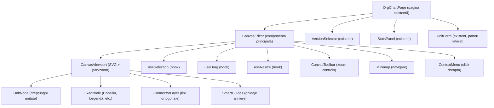
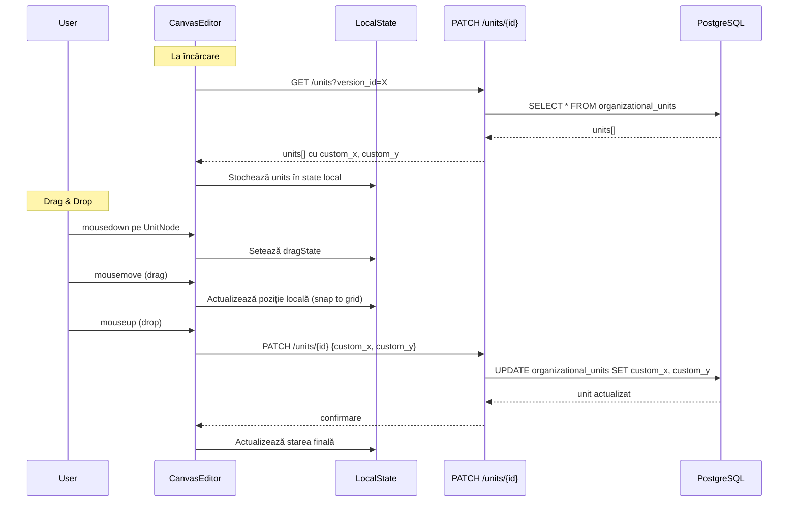

# Document de Design: drawio-orgchart-editor

## Prezentare Generală

Acest design descrie înlocuirea componentei monolitice `DeterministicOrgChart.jsx` (~2300+ linii) cu un editor de canvas modular, inspirat din draw.io. Noul editor oferă un canvas SVG infinit cu pan/zoom, drag & drop manual, redimensionare, conectori ortogonali și minimap, păstrând exact layout-ul existent din baza de date (custom_x, custom_y, custom_width, custom_height).

**Principiu fundamental**: Pozițiile din DB sunt sursa de adevăr. Editorul NU recalculează layout-ul — doar citește și afișează fidel coordonatele existente. Modificările se fac exclusiv prin interacțiune manuală (drag & drop, resize).

**Stack tehnic**: React 18, SVG nativ (fără biblioteci externe de canvas), TailwindCSS, TanStack Query, Sonner (toast-uri).

## Arhitectură

### Diagrama de Componente



### Diagrama de Flux de Date



## Componente și Interfețe

### 1. CanvasEditor (componenta principală)

Înlocuiește `DeterministicOrgChart`. Orchestrează toate sub-componentele.

```typescript
// Props
interface CanvasEditorProps {
  versionId: string;
  onSelectUnit: (unit: OrgUnit) => void;
  isReadOnly: boolean;
}

// State intern gestionat prin hooks
interface CanvasState {
  units: OrgUnit[];           // Toate unitățile versiunii
  viewport: ViewportState;     // Pan/zoom
  selection: SelectionState;   // Unitate selectată
  drag: DragState;            // Stare drag curentă
  resize: ResizeState;        // Stare resize curentă
}
```

### 2. CanvasViewport (SVG cu pan/zoom)

Gestionează transformarea SVG (translate + scale) pentru pan și zoom.

```typescript
interface ViewportState {
  panX: number;        // Offset X (translație)
  panY: number;        // Offset Y (translație)
  zoom: number;        // Factor de zoom (0.1 - 3.0)
}

// Hook: useViewport
function useViewport(): {
  viewport: ViewportState;
  handlers: {
    onWheel: (e: WheelEvent) => void;      // Zoom cu scroll
    onMouseDown: (e: MouseEvent) => void;   // Început pan
    onMouseMove: (e: MouseEvent) => void;   // Pan activ
    onMouseUp: () => void;                  // Sfârșit pan
  };
  actions: {
    resetZoom: () => void;          // Ctrl+0
    fitToContent: (units: OrgUnit[]) => void;  // Ctrl+1
    zoomIn: () => void;
    zoomOut: () => void;
    panTo: (x: number, y: number) => void;
  };
  svgTransform: string;  // "translate(panX, panY) scale(zoom)"
}
```

### 3. UnitNode (randare unitate)

Randează o unitate organizatorică ca dreptunghi SVG. Păstrează exact stilizarea vizuală actuală.

```typescript
interface UnitNodeProps {
  unit: OrgUnit;
  aggregates: UnitAggregates;
  isSelected: boolean;
  isDragging: boolean;
  isReadOnly: boolean;
  position: { x: number; y: number };  // Poate fi temporară în timpul drag
  onMouseDown: (e: MouseEvent, unit: OrgUnit) => void;
  onContextMenu: (e: MouseEvent, unit: OrgUnit) => void;
}
```

Structura SVG a unui UnitNode:
- `<rect>` principal cu border și fundal (culoare din `unit.color`)
- Strip lateral stâng colorat cu numere posturi (conducere/execuție)
- `<text>` pentru cod STAS
- `<text>` pentru numele unității (cu word-wrap)
- `<text>` pentru numere posturi
- Handle-uri de resize (vizibile doar când selectat, în mod edit)
- Suport `is_rotated` prin `transform="rotate(90)"` pe grup

### 4. FixedNode (elemente speciale)

Randează elementele fixe: Consiliu de Conducere, mini-legendă Director General, Legendă, titluri header.

```typescript
interface FixedNodeProps {
  type: 'consiliu' | 'director_legend' | 'legend' | 'header';
  unit: OrgUnit | null;       // Datele unității asociate
  position: { x: number; y: number; width: number; height: number };
  isReadOnly: boolean;
  onMouseDown: (e: MouseEvent) => void;
  onClick: (unit: OrgUnit) => void;
}
```

### 5. ConnectorLayer (conectori ortogonali)

Desenează liniile de conexiune între unități părinte-copil.

```typescript
interface ConnectorLayerProps {
  units: OrgUnit[];
  positions: Map<string, { x: number; y: number; width: number; height: number }>;
}

// Algoritmul de conectori:
// 1. De la centrul marginii inferioare a părintelui, linie verticală în jos
// 2. Linie orizontală de distribuție la nivelul Y intermediar
// 3. De la linia de distribuție, linii verticale în jos către centrul marginii superioare a fiecărui copil
```

### 6. Hooks de Interacțiune

#### useDrag

```typescript
interface DragState {
  isDragging: boolean;
  unitId: string | null;
  startPos: { x: number; y: number };
  currentPos: { x: number; y: number };
  offset: { x: number; y: number };
}

function useDrag(params: {
  units: OrgUnit[];
  viewport: ViewportState;
  isReadOnly: boolean;
  onDragEnd: (unitId: string, newX: number, newY: number) => Promise<void>;
}): {
  dragState: DragState;
  handlers: {
    onNodeMouseDown: (e: MouseEvent, unit: OrgUnit) => void;
    onCanvasMouseMove: (e: MouseEvent) => void;
    onCanvasMouseUp: () => void;
  };
  getNodePosition: (unitId: string) => { x: number; y: number };
}
```

#### useResize

```typescript
interface ResizeState {
  isResizing: boolean;
  unitId: string | null;
  handle: 'n' | 's' | 'e' | 'w' | 'ne' | 'nw' | 'se' | 'sw';
  startSize: { width: number; height: number };
  currentSize: { width: number; height: number };
}

function useResize(params: {
  isReadOnly: boolean;
  onResizeEnd: (unitId: string, newWidth: number, newHeight: number) => Promise<void>;
}): {
  resizeState: ResizeState;
  handlers: {
    onHandleMouseDown: (e: MouseEvent, unitId: string, handle: string) => void;
    onMouseMove: (e: MouseEvent) => void;
    onMouseUp: () => void;
  };
  getNodeSize: (unitId: string, defaultSize: { width: number; height: number }) => { width: number; height: number };
}
```

#### useSelection

```typescript
function useSelection(): {
  selectedUnitId: string | null;
  select: (unitId: string) => void;
  deselect: () => void;
}
```

### 7. SmartGuides (ghidaje de aliniere)

```typescript
interface SmartGuidesProps {
  draggedUnit: { id: string; x: number; y: number; width: number; height: number } | null;
  allUnits: OrgUnit[];
  threshold: number;  // 5px
}
```

Afișează linii punctate orizontale/verticale când unitatea trasă se aliniază cu alte unități (centru-centru, margine-margine).

### 8. Minimap

```typescript
interface MinimapProps {
  units: OrgUnit[];
  viewport: ViewportState;
  canvasSize: { width: number; height: number };
  onNavigate: (x: number, y: number) => void;
  size: { width: 200; height: 150 };
}
```

### 9. CanvasToolbar

```typescript
interface CanvasToolbarProps {
  zoom: number;
  onZoomIn: () => void;
  onZoomOut: () => void;
  onFitToContent: () => void;
  onResetZoom: () => void;
  isReadOnly: boolean;
  onAddUnit: () => void;
}
```

### 10. ContextMenu

```typescript
interface ContextMenuProps {
  position: { x: number; y: number } | null;
  unit: OrgUnit | null;
  isReadOnly: boolean;
  onEdit: () => void;
  onAddChild: () => void;
  onDelete: () => void;
  onRotate: () => void;
  onClose: () => void;
}
```

## Modele de Date

### OrgUnit (din backend, fără modificări)

```typescript
interface OrgUnit {
  id: string;                    // UUID
  version_id: string;            // UUID
  stas_code: string;             // Cod STAS (ex: "1000")
  name: string;                  // Denumire unitate
  unit_type: string;             // director_general | directie | serviciu | compartiment | inspectorat | birou | consiliu | legend
  parent_unit_id: string | null; // UUID părinte
  order_index: number;           // Ordine între frați
  leadership_count: number;      // Nr. posturi conducere
  execution_count: number;       // Nr. posturi execuție
  color: string | null;          // Culoare (ex: "#86C67C" sau "#86C67C-full")
  custom_x: number | null;       // Poziție X pe canvas
  custom_y: number | null;       // Poziție Y pe canvas
  custom_width: number | null;   // Lățime custom
  custom_height: number | null;  // Înălțime custom
  director_title: string | null; // Titlu director (doar pt director_general)
  director_name: string | null;  // Nume director (doar pt director_general)
  legend_col1: string | null;    // Text coloana 1 legendă
  legend_col2: string | null;    // Text coloana 2 legendă
  legend_col3: string | null;    // Text coloana 3 legendă
  is_rotated: boolean;           // Rotit la 90°
}
```

### UnitAggregates (din layout API)

```typescript
interface UnitAggregates {
  leadership_positions_count: number;
  execution_positions_count: number;
  total_positions: number;
  recursive_total_subordinates: number;
}
```

### ViewportState (state local)

```typescript
interface ViewportState {
  panX: number;   // Translație X (default: 0)
  panY: number;   // Translație Y (default: 0)
  zoom: number;   // Factor zoom (default: 1.0, range: 0.1 - 3.0)
}
```

### Constante de Layout

```typescript
const GRID_SIZE = 20;                    // Dimensiune celulă grid (px)
const DEFAULT_UNIT_WIDTH = 320;          // Lățime implicită unitate (px)
const DEFAULT_UNIT_HEIGHT = 45;          // Înălțime implicită unitate (px)
const MIN_UNIT_WIDTH = 100;              // Lățime minimă (px)
const MIN_UNIT_HEIGHT = 40;              // Înălțime minimă (px)
const ZOOM_MIN = 0.1;                   // Zoom minim (10%)
const ZOOM_MAX = 3.0;                   // Zoom maxim (300%)
const ZOOM_STEP = 0.1;                  // Pas zoom per scroll
const SMART_GUIDE_THRESHOLD = 5;         // Prag aliniere ghidaje (px)
const CONNECTOR_VERTICAL_GAP = 20;       // Spațiu vertical conector (px)
const NEW_UNIT_VERTICAL_OFFSET = 100;    // Offset Y pentru unitate nouă sub părinte
const NEW_UNIT_HORIZONTAL_GAP = 40;      // Spațiu orizontal între frați noi
```

### Funcții Utilitare Cheie

```typescript
// Snap la grid de 20px
function snapToGrid(value: number): number {
  return Math.round(value / GRID_SIZE) * GRID_SIZE;
}

// Conversie coordonate ecran → canvas (ținând cont de pan/zoom)
function screenToCanvas(screenX: number, screenY: number, viewport: ViewportState): { x: number; y: number } {
  return {
    x: (screenX - viewport.panX) / viewport.zoom,
    y: (screenY - viewport.panY) / viewport.zoom,
  };
}

// Conversie coordonate canvas → ecran
function canvasToScreen(canvasX: number, canvasY: number, viewport: ViewportState): { x: number; y: number } {
  return {
    x: canvasX * viewport.zoom + viewport.panX,
    y: canvasY * viewport.zoom + viewport.panY,
  };
}

// Calculare bounding box al tuturor unităților (pentru fit-to-content)
function calculateBoundingBox(units: OrgUnit[]): { minX: number; minY: number; maxX: number; maxY: number } {
  // Iterează toate unitățile, calculează min/max ținând cont de custom_x/y/width/height
}

// Calculare poziție pentru unitate nouă
function calculateNewUnitPosition(parentUnit: OrgUnit | null, siblingUnits: OrgUnit[]): { x: number; y: number } {
  // Dacă are părinte: sub părinte, decalat 100px vertical, centrat orizontal
  // Dacă are frați: la dreapta ultimului frate + 40px
  // Dacă nu are părinte: centrul viewport-ului curent
}

// Generare path SVG pentru conector ortogonal
function generateConnectorPath(
  parent: { x: number; y: number; width: number; height: number },
  child: { x: number; y: number; width: number; height: number }
): string {
  // Linie verticală din centrul-jos al părintelui
  // Linie orizontală la nivel intermediar
  // Linie verticală către centrul-sus al copilului
}

// Generare path SVG pentru conectori grupați (mai mulți copii)
function generateGroupedConnectorPaths(
  parent: { x: number; y: number; width: number; height: number },
  children: Array<{ x: number; y: number; width: number; height: number }>
): string[] {
  // Linie verticală din centrul-jos al părintelui până la Y intermediar
  // Linie orizontală de la cel mai din stânga copil la cel mai din dreapta
  // Linii verticale de la linia orizontală către fiecare copil
}

// Calculare dimensiune box bazată pe lungimea textului (fallback)
function calculateBoxHeight(unitName: string): number {
  const len = unitName.length;
  if (len <= 35) return 40;
  if (len <= 50) return 40;
  return 60;
}
```


## Proprietăți de Corectitudine

*O proprietate este o caracteristică sau un comportament care trebuie să fie adevărat în toate execuțiile valide ale unui sistem — în esență, o declarație formală despre ce ar trebui să facă sistemul. Proprietățile servesc ca punte între specificațiile citibile de oameni și garanțiile de corectitudine verificabile de mașini.*

### Proprietatea 1: Pozițiile și dimensiunile din DB sunt respectate fidel

*Pentru orice* unitate cu custom_x, custom_y, custom_width și custom_height definite, poziția și dimensiunile randate pe canvas trebuie să fie identice cu valorile din baza de date, fără nicio recalculare sau ajustare. Dacă custom_width sau custom_height nu sunt definite, se folosesc valorile implicite (320px lățime, 45px înălțime calculată din lungimea numelui).

**Validates: Requirements 2.1, 2.7**

### Proprietatea 2: Snap la grid produce multipli de 20

*Pentru orice* valoare numerică (poziție sau dimensiune), funcția snapToGrid trebuie să returneze cel mai apropiat multiplu de 20. Formal: `snapToGrid(v) === Math.round(v / 20) * 20` și `snapToGrid(v) % 20 === 0`.

**Validates: Requirements 3.2, 4.3**

### Proprietatea 3: Zoom-ul este întotdeauna în intervalul [0.1, 3.0]

*Pentru orice* secvență de operații de zoom (scroll, zoom in, zoom out, fit-to-content), valoarea zoom-ului trebuie să rămână întotdeauna între 0.1 și 3.0 inclusiv.

**Validates: Requirements 1.4**

### Proprietatea 4: Zoom centrat pe cursor păstrează punctul fix

*Pentru orice* poziție a cursorului pe canvas și orice delta de zoom, punctul de pe canvas aflat sub cursor trebuie să rămână la aceeași poziție pe ecran după aplicarea zoom-ului. Formal: `screenToCanvas(cursorScreenX, cursorScreenY, newViewport) === screenToCanvas(cursorScreenX, cursorScreenY, oldViewport)` (cu toleranță de ±1px).

**Validates: Requirements 1.3**

### Proprietatea 5: Fit-to-content include toate unitățile în viewport

*Pentru orice* set de unități cu poziții definite, după executarea fit-to-content, toate unitățile trebuie să fie vizibile în viewport-ul curent (adică bounding box-ul tuturor unităților este conținut în zona vizibilă a ecranului).

**Validates: Requirements 1.6, 11.3**

### Proprietatea 6: Operațiile de editare sunt activate doar pentru versiuni draft

*Pentru orice* versiune, funcționalitățile de drag, resize, adăugare și ștergere sunt activate dacă și numai dacă starea versiunii este "draft". Pentru orice altă stare (approved, pending_approval, archived), toate operațiile de editare sunt dezactivate.

**Validates: Requirements 3.5, 7.1, 7.2**

### Proprietatea 7: Unitățile fără poziție custom primesc poziție de fallback

*Pentru orice* unitate care nu are custom_x sau custom_y definite: dacă are un parent_unit_id valid cu poziție cunoscută, unitatea este plasată sub părinte; dacă nu are părinte, este plasată la coordonatele (100, 100).

**Validates: Requirements 2.2**

### Proprietatea 8: Culoarea determină modul de afișare (strip vs full)

*Pentru orice* unitate cu câmpul color definit, dacă valoarea color se termină cu "-full", fundalul complet al dreptunghiului primește culoarea; altfel, doar strip-ul lateral stâng primește culoarea. Formal: `isFullColor(color) === color.endsWith("-full")`.

**Validates: Requirements 2.4**

### Proprietatea 9: Conectorii au endpoint-uri corecte și segmente ortogonale

*Pentru orice* pereche părinte-copil cu poziții și dimensiuni cunoscute, conectorul generat trebuie să: (a) pornească din centrul marginii inferioare a părintelui `(parent.x + parent.width/2, parent.y + parent.height)`, (b) ajungă la centrul marginii superioare a copilului `(child.x + child.width/2, child.y)`, și (c) să conțină doar segmente orizontale și verticale (fără diagonale).

**Validates: Requirements 5.1, 5.3**

### Proprietatea 10: Conectorii grupați partajează o linie orizontală comună

*Pentru orice* unitate părinte cu mai mult de un copil, conectorul generat trebuie să conțină o singură linie orizontală de distribuție de la care pleacă linii verticale către fiecare copil, în loc de conectori individuali separați.

**Validates: Requirements 5.5**

### Proprietatea 11: Ghidajele de aliniere detectează alinierea corectă

*Pentru orice* unitate trasă și set de unități existente, ghidajele de aliniere trebuie să fie afișate dacă și numai dacă centrul sau marginea unității trase este la o distanță mai mică de `SMART_GUIDE_THRESHOLD` (5px) de centrul sau marginea unei alte unități, pe axa orizontală sau verticală.

**Validates: Requirements 3.3**

### Proprietatea 12: Detectarea suprapunerii funcționează corect

*Pentru orice* două dreptunghiuri (unități) cu poziții și dimensiuni cunoscute, funcția de detectare a suprapunerii trebuie să returneze true dacă și numai dacă cele două dreptunghiuri se intersectează (au o zonă comună nenulă).

**Validates: Requirements 3.6**

### Proprietatea 13: Redimensionarea respectă dimensiunile minime

*Pentru orice* operație de redimensionare (handle + delta mouse), dimensiunile rezultate trebuie să fie cel puțin 100px lățime și 40px înălțime, indiferent de direcția sau magnitudinea drag-ului.

**Validates: Requirements 4.2, 4.4**

### Proprietatea 14: Rollback la eroare de salvare restaurează poziția originală

*Pentru orice* unitate cu o poziție inițială, dacă salvarea prin API eșuează, poziția unității trebuie să revină exact la valorile anterioare (custom_x și custom_y de dinainte de drag).

**Validates: Requirements 9.3**

### Proprietatea 15: Minimap — conversia coordonatelor canvas ↔ minimap este consistentă

*Pentru orice* punct de pe canvas și dimensiuni ale minimap-ului, conversia de la coordonate canvas la coordonate minimap și înapoi trebuie să producă punctul original (round-trip). Formal: `canvasToMinimap(minimapToCanvas(point)) ≈ point` (cu toleranță de ±1px).

**Validates: Requirements 10.2, 10.3, 10.4, 10.5**

### Proprietatea 16: Plasarea unităților noi respectă regulile de poziționare

*Pentru orice* context de creare a unei unități noi: (a) dacă are părinte fără alți copii, este plasată sub părinte la offset vertical de 100px, centrată orizontal; (b) dacă are părinte cu copii existenți, este plasată la dreapta ultimului copil cu spațiu de 40px; (c) dacă nu are părinte, este plasată în centrul viewport-ului curent.

**Validates: Requirements 12.1, 12.2, 12.3**

## Gestionarea Erorilor

| Scenariu | Comportament |
|----------|-------------|
| API PATCH eșuează la salvarea poziției | Toast de eroare via Sonner, rollback la poziția anterioară |
| API GET eșuează la încărcarea unităților | Toast de eroare, afișare mesaj "Eroare la încărcarea organigramei" pe canvas |
| API DELETE eșuează la ștergerea unității | Toast de eroare, unitatea rămâne pe canvas |
| API POST eșuează la crearea unității | Toast de eroare, dialog de creare rămâne deschis |
| Unitate fără custom_x/custom_y | Plasare la poziție de fallback, marcare vizuală cu border punctat |
| Referință circulară în ierarhie (parent_unit_id) | Detectare la generarea conectorilor, ignorare conector pentru a evita bucle infinite |
| Versiune non-draft selectată | Dezactivare completă a tuturor operațiilor de editare (drag, resize, context menu edit/delete) |
| Zoom la limită (0.1 sau 3.0) | Clamp la valoarea limită, fără eroare |
| Resize sub dimensiunea minimă | Clamp la 100px lățime / 40px înălțime |
| Pierderea conexiunii la server | Toast de eroare la prima operație eșuată, starea locală rămâne intactă |

## Strategie de Testare

### Abordare Duală: Teste Unitare + Teste Property-Based

Testarea va folosi două abordări complementare:

1. **Teste unitare** (Vitest): pentru exemple specifice, cazuri limită și integrare
2. **Teste property-based** (fast-check cu Vitest): pentru proprietăți universale pe inputuri generate aleator

### Bibliotecă PBT: fast-check

Se va folosi `fast-check` (https://github.com/dubzzz/fast-check) ca bibliotecă de property-based testing, integrată cu Vitest.

### Configurare

- Minimum **100 de iterații** per test property-based
- Fiecare test PBT va avea un comentariu de referință la proprietatea din design
- Format tag: **Feature: drawio-orgchart-editor, Property {number}: {property_text}**
- Fiecare proprietate de corectitudine va fi implementată de un **singur** test property-based

### Teste Property-Based (din proprietățile de corectitudine)

| Proprietate | Test PBT |
|-------------|----------|
| P1: Poziții/dimensiuni din DB | Generare unități random cu custom_x/y/width/height → verificare că getNodePosition și getNodeSize returnează valorile din DB |
| P2: Snap la grid | Generare valori numerice random → verificare snapToGrid returnează multiplu de 20 |
| P3: Zoom clamped | Generare secvențe random de zoom operations → verificare zoom ∈ [0.1, 3.0] |
| P4: Zoom centrat pe cursor | Generare cursor position + zoom delta → verificare punct fix sub cursor |
| P5: Fit-to-content | Generare seturi random de unități cu poziții → verificare toate sunt în viewport după fit |
| P6: Read-only pentru non-draft | Generare versiuni cu statusuri random → verificare isEditable === (status === 'draft') |
| P7: Fallback poziție | Generare unități fără custom_x/y cu/fără părinte → verificare poziție de fallback |
| P8: Color strip vs full | Generare stringuri de culoare random (cu/fără "-full") → verificare mod afișare |
| P9: Conectori ortogonali | Generare perechi părinte-copil cu poziții random → verificare endpoint-uri și segmente ortogonale |
| P10: Conectori grupați | Generare părinte cu N copii random → verificare linie orizontală comună |
| P11: Smart guides | Generare unitate trasă + set unități → verificare detectare aliniere la threshold |
| P12: Detectare suprapunere | Generare perechi de dreptunghiuri random → verificare overlap detection |
| P13: Resize min dimensions | Generare resize operations random → verificare width ≥ 100, height ≥ 40 |
| P14: Rollback la eroare | Generare unități cu poziții random + simulare eroare API → verificare revert |
| P15: Minimap round-trip | Generare puncte canvas random → verificare canvasToMinimap(minimapToCanvas(p)) ≈ p |
| P16: Plasare unități noi | Generare contexte de creare random → verificare regulile de poziționare |

### Teste Unitare (exemple specifice și cazuri limită)

- Ctrl+0 resetează zoom la 1.0 și pan la (0,0)
- Click pe unitate → selectare + deschidere panou lateral
- Click pe zonă goală → deselectare
- Escape → deselectare
- Tasta R → toggle is_rotated pe unitatea selectată
- Schimbare versiune → reîncărcare unități
- Salvare poziție prin PATCH API (mock)
- Salvare dimensiuni prin PATCH API (mock)
- Afișare buton "Adaugă Unitate" doar în mod draft
- Zoom percentage display (zoom * 100 + "%")
- Unitate nouă fără părinte → centrul viewport-ului
- Eroare API → toast + rollback
